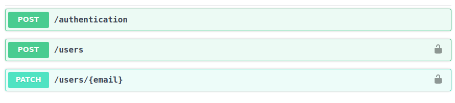

# APIs Documentation
## Authentication api

For the authentication API we have one table, `users_entity` that is represented by multiple parameters.


For this api we have 3 different endpoint



1. _/authentication_

   - this endpoint is used to get a JWT that will be used on the other API. The payload that we need to supplie is the following.

     ```json
     {
       "email": "string",
       "password": "string"
     }
     ```

     

## Application api
