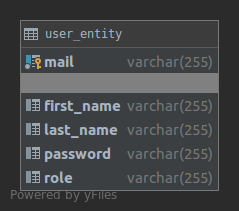
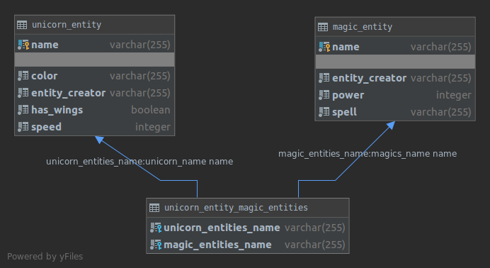

# APIs Documentation

We chose to create an add-on for our first project (Dungeons and Unicorns). This API will be focus on unicorns. Since a unicorn is a magic animal it must have magic powers. Is that our application wanted to set up. So an unicorn can have multiple magics that represent a magic spell.GIT

## Authentication api

### Structure 

For the authentication API we have one table, `users_entity` that is represented by multiple parameters.



To get the documentation about the endpoints you can go on [http://localhost/auth/swagger-ui.html](http://localhost/auth/swagger-ui.html) when the topology is launched.

Once you are logged you receive a JWT to be able to make other call on API (add a user and update your password).

### Choices

#### API "privacy"

For this API we only have 3 endpoint:

- one for authentication
- one to add a new user (only for admin users)
- one to update his password

We chose to expose only thews endpoint to be very strict. We have no utility yet to get the user informations or a list of all users, that's why we don't have a `get /users` or a `get /users/<mail>`.

#### Admin privilege

We chose the point that only an administrator can add an account to the auth api.

#### Update password

To update the password we use the method `PATCH`. We chose this method because for an `user_entity` we will only change one properties and the payload of the request is identical for every requests (except the value of the password of cours).

#### Payload verification

To verify that the payload given in the request is valid we implemented a kind of _reflexion_. For the class of the payload we get all _getter_ and then we apply them on the payload and we check that the result of the _getter_ method is not null or not empty.

```java
    /**
     * This method check that the payload is valid. A valid payload mean that
     * all value were given and that they were not empty
     * @param payload the payload that we want to test if it's valid
     * @param list the list with all getter of the payload's class
     * @return true is the payload is valid, false otherwise
     */
    private boolean checkPayloadIsValidImplementation(Object payload, List<Method> list){
        Object object;
        for (Method method : list) {
            try {
                object = method.invoke(payload);
                if (object == null || object.toString().isEmpty()) {
                    return false;
                }
            } catch (Exception e) {
                return false;
            }
        }
        return true;
    }

    /**
     * This method will return the list of all getter of a class
     * @param c the class that we want to analyse
     * @return a list of method
     */
    public boolean checkPayloadIsValid(Class<?> c, Object payload) {
        ArrayList<Method> list = new ArrayList<>();
        Method[] methods = c.getDeclaredMethods();
        for (Method method : methods)
            if (isGetter(method))
                list.add(method);
        return checkPayloadIsValidImplementation(payload, list);
    }
```

#### Management of error code

Our _ApiController_ delegate the work to a _business_ class that will do all the logic, the controller will _catch_ errors throw by _business_ and then get the code thrown and send it as a HTTP error code.

## Application api

To use this API you need to have a valid JWT given by the _authentication api_. To give the token you have to put it in an `Authorization` header with the value `Bearer <token>`. 

### Structure

For the application API we have 3 tables : `magic_entity`, `unicorn_entity` and `unicorn_entity_magic_entities`. This last one is the table generated by the relation `ManyToMany` between `magic_entity` and `unicorn_entity`.



We chose that the `name` field of a unicorn_entity and magic_entity is the ID of the table. This implies that each object is unique because it is represented by its name. This has several repercussions:

- if an user added a magic with a name, an other user can't add an magic with the same name. This is a little bit annoying because a magic have an owner and that only the owner can use the magic to link it to a unicorn.
- when we create a magic or a unicorn we doesn't respond with a `Location` header or with the object created in the body. We chose to do that because the ID of the object is the name that we entered, so it's easy to know the ID to get the object with an other endpoint.

### Choices

#### Table relation

We chose a relation `ManyToMany` between our two tables. This choice mean that we have to take care to "wire" both side of the relation. We manage this relationship only in one place in the code, that's why we still chose this option but if the API grow it would be a good idea to to a table.

#### JWT filter

We chose to implement a filter that will be used to verify the JWT. The filter is responsible to get the header, remove the word `Bearer ` and then check the signature of the token. This approach  mean that our controller/business services won't be used to verify the token and can focus on the business.

#### Pagination

We have to use paging in one of our endpoint, we chose to implement paging when a user want to list all of his magics or unicorns (`get /magics` or `get /unicorns`). To inform the "user" about the total number of items and the next page we added two header to the response: `Pagination-NumberOfItems` and `Pagination-Next`.