# Testing

There are a lot of possibilities when we talk about tests. The image below show a classification of all tests. With _Cucumber_ we are in the quadrant Q1: **Unit tests and Integration tests** and with _JMeter_ we are in the quadrant Q4: **performance tests, security tests and fault-tolerance test**. We talk more about both strategy right after.

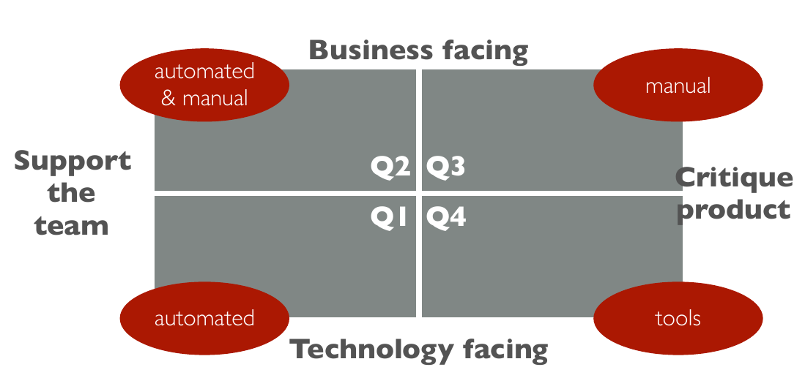

## Test Cucumber JVM

Cucumber allows us to do units tests that can be run automatically with _maven_. These tests allow us to test the behavior of the API according to the given parameters, these parameters should test all the possible requests that could be send to the API (no token, wrong payload, right request), it's the idea of "Behaviour Driven Development". 

_Cucumber_ allow us to have a description of a scenario written in English and then comprehensive by people for example:

```gherkin
  Scenario: login to api
    Given I have a credential payload
    When I POST it to the /authentication endpoint
    Then I receive a 200 status code and a token
```

Here it's very comprehensive what we want to test. And then we have the implementation of these description in _Java_ :

```java
@Given("^I have a credential payload$")
public void iHaveACredentialPayload() {
    userCredentials = new ch.heigvd.amt.users.api.dto.UserCredentials();
    userCredentials.setEmail("admin@admin.ch");
    userCredentials.setPassword("test");
}

@When("^I POST it to the /authentication endpoint$")
public void iPOSTItToTheAuthenticationEndpoint() {
    try {
        environment.setLastApiResponse(api.authenticateUserWithHttpInfo(userCredentials));
        environment.setLastApiCallThrewException(false);
        environment.setLastApiException(null);
        environment.setLastStatusCode(environment.getLastApiResponse().getStatusCode());
        token = environment.getLastApiResponse().getData().toString();
    } catch (ApiException e) {
        environment.setLastApiCallThrewException(true);
        environment.setLastApiResponse(null);
        environment.setLastApiException(e);
        environment.setLastStatusCode(environment.getLastApiException().getCode());
    }
}

@Then("^I receive a (\\d+) status code and a token$")
public void iReceiveAStatusCodeAndAToken(int arg0) {
    assertEquals(arg0, environment.getLastStatusCode());
    assertNotNull(token);
}
```

The idea of these two "implementation" is that you can give the first one to the manager and he will understand what you test and how, without reading the code. This allow an other team to write the acceptance criteria in plain English and then give this to the developer team.

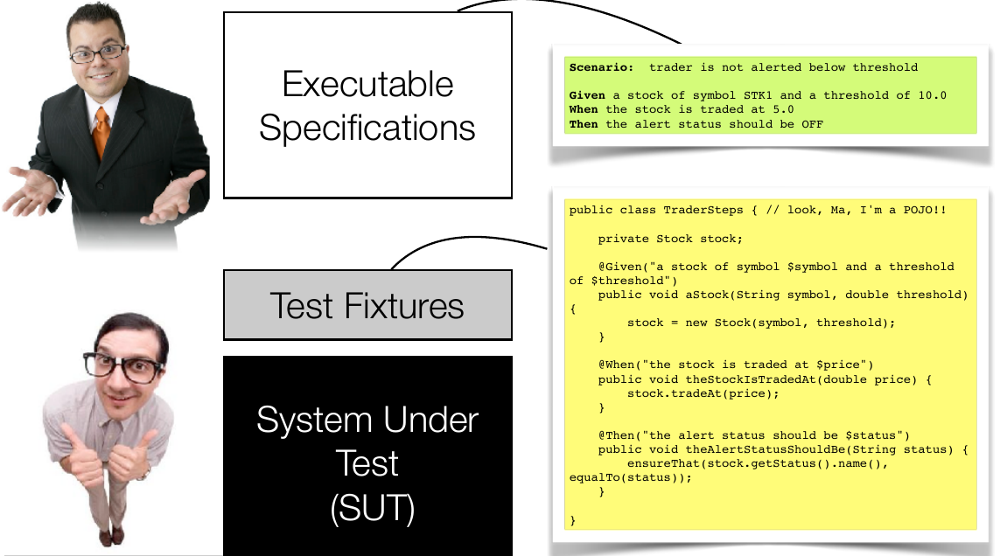

_Cucumber_ and _picocontainer_ operate as follows : when a scenario begins an `Environment` class is instantiated with dependency injection. Then _picocontainer_ will parse the sentences in English and will browse the `Steps` classes. When it finds a match it knows that it will have to instantiate the so-called `Steps` class. We can notice that in the constructors of the Steps classes we pass the `Environment` object as a parameter. So the environment is common to all instantiated steps classes

## Test JMeter

JMeter allows us to test load on APIs and how the behaviors is influenced by this load. We are going to test what happen when :

- there is no paging and a lot of users 
- there is paging with a lot of users

These tests will allows us to show the importance of paging and they could also show some weird behaviors. 

Firstly we need to get a token to access to the Unicorns API so we make a request to the authentication API with a valid email and password.

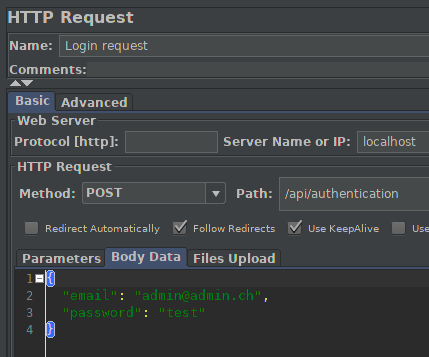

We extract the token from the response and we store it as a _JMeter_ variable.

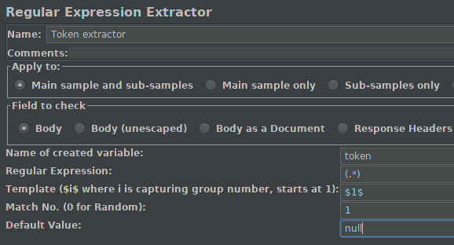

We set the token in the header of the second request.

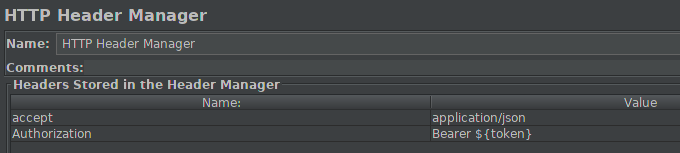

We give the URL and parameters of the request.

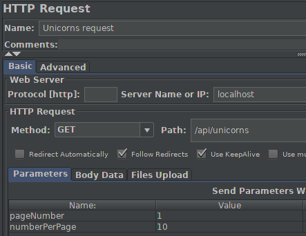

And when we receive a response we can see that we get data and paging header.

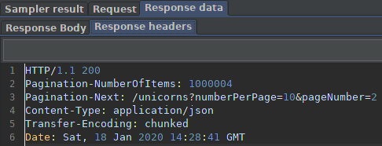

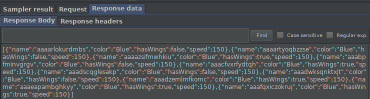

To launch tests we used the CLI, because it's more efficient. The command that we used was : 

```bash
JVM_ARGS='-Xms8192m -Xmx8192m' ./bin/jmeter -n -t ../AMT/Teaching-HEIGVD-AMT-2019-Project-Two/JMeter/testPlan/Paging.jmx  -l ../AMT/Teaching-HEIGVD-AMT-2019-Project-Two/JMeter/<resultName> -e -o ../AMT/Teaching-HEIGVD-AMT-2019-Project-Two/JMeter/report/<resultName>
```


## Opinions

### Cucumber

We are pretty happy about our _Cucumber_ tests because they cover a lot of code of our APIs. We tried to test every scenario that could happen in APIs. Here are screen shots of code coverage obtained with the tests.

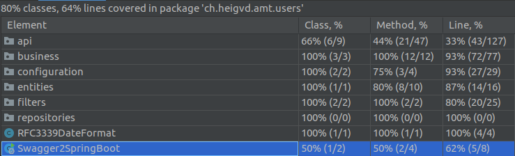

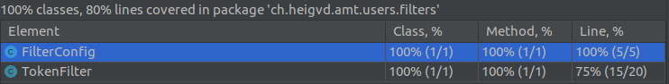

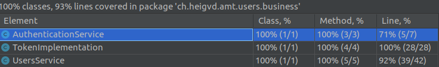

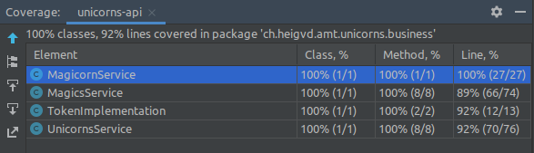

We manage to factorize some tests definition with regex and by putting them in the class _CommonSteps_. To do that we had to put all common variables in the _Environment_ class so that every steps class could get these variables.

```java
    @Then("^I receive a (\\d+) status code$")
    public void i_receive_a_status_code(int arg1) throws Throwable {
        assertEquals(arg1, environment.getLastStatusCode());
    }
```


### JMeter

We are not surprise by the result of JMeter. Like in the first project we tested with and without paging on one endpoint. With no surprise when there is no pagination the application is very slow to respond and sometime it crash.

This is a summarize table of the first JMeter test.

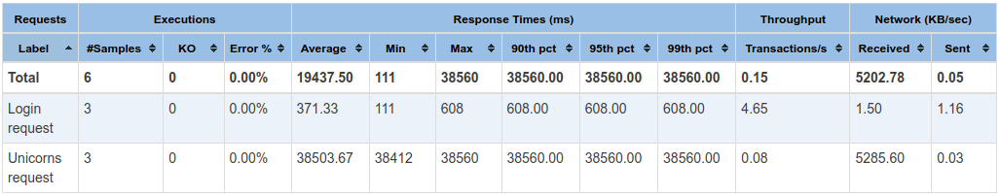

This test was 1 _thread_ with 3 requests, this means that each request was launched sequentially. Here we have an average response time of **38 seconds**.

In an other test that we made we tried to simulate the fact that 10 different users come on the API, this mean 10 _thread_ with one request. 

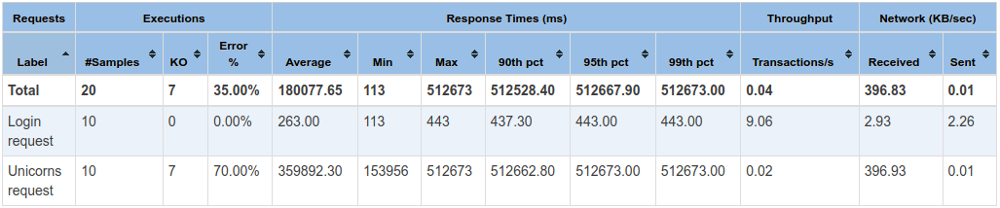

Here the result is worst, the application crashed on 7 requests and the average response time is **6 minutes**.

After that we changed and we used paging. On this test we requested the 1st page and 10 object on the page.

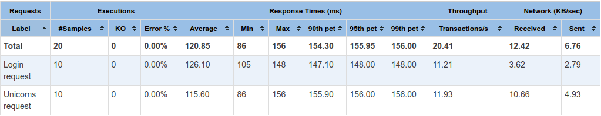

And on this one we requested the 100th page with 49 object on the page.

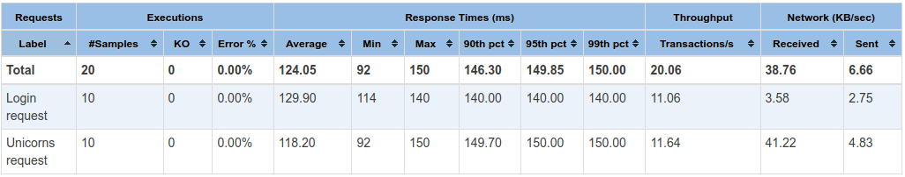

We can see that the time difference between the fact to ask the 1st or th 100th page is 3 ms, this is negligible.

## Experiment

### JMeter

As we already used _JMeter_ it was easy to implement our tests. We had some issue because _JMeter variables_ are not shared between _thread group_ so we had to make a request login every time, but it's not a problem.

### Cucumber

Cucumber tests are not easy at the beginning, it's important to understand how it's work behind the scene. But when you know the machine it's fast and easy to implement. It's interesting to use the regex feature, it allow a lot of factorizing. As our both controllers (unicorn and magic) have the same behaviors, we have done all tests for one controller and we copied them for the other controller and we changed all unicorn related object by magic object.


